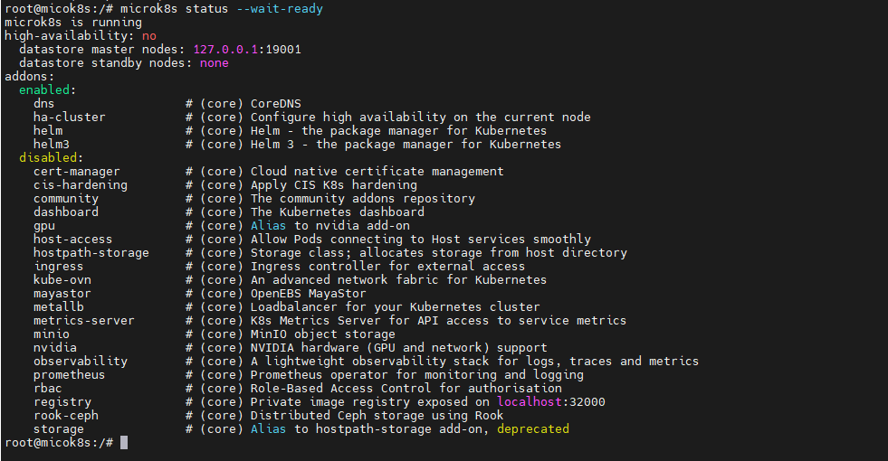
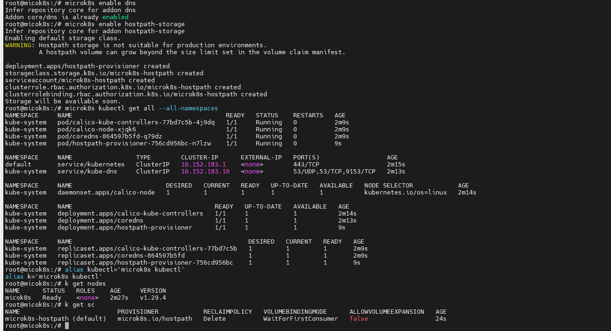

## 1. Install MicroK8s on Ubuntu 22.04
```shell
sudo apt update -y

sudo snap install microk8s --classic --channel=1.29

microk8s status --wait-ready
```


```shell
microk8s enable dns
microk8s enable hostpath-storage
microk8s kubectl get all --all-namespaces

alias kubectl='microk8s kubectl'
alias k='microk8s kubectl'
```


## 2. Install helm charts
```shell
curl -fsSL -o get_helm.sh https://raw.githubusercontent.com/helm/helm/main/scripts/get-helm-3
chmod 700 get_helm.sh
./get_helm.sh
```
# Install Ingress
```shell
microk8s enable ingress
# sample
cat <<EOF | kubectl apply -f -
apiVersion: networking.k8s.io/v1
kind: Ingress
metadata:
  name: http-ingress
spec:
  rules:
  - http:
      paths:
      - path: /
        pathType: Prefix
        backend:
          service:
            name: some-service
            port:
              number: 80
EOF
```
# Install ArgoCD
```shell
kubectl create namespace argocd
kubectl apply -n argocd -f https://raw.githubusercontent.com/argoproj/argo-cd/stable/manifests/install.yaml
# Patch nodePort for argocd
kubectl patch svc argocd-server -n argocd -p '{"spec": {"type": "NodePort"}}'
kubectl get svc -n argocd | grep NodePort
# Get password of admin user
kubectl get secret -n argocd argocd-initial-admin-secret -o=jsonpath='{.data.password}' | base64 -d; echo
```
# Install Tekton

```shell
kubectl apply --filename https://storage.googleapis.com/tekton-releases/pipeline/latest/release.yaml
kubectl apply --filename https://storage.googleapis.com/tekton-releases/triggers/latest/release.yaml
kubectl apply --filename https://storage.googleapis.com/tekton-releases/triggers/latest/interceptors.yaml
kubectl apply --filename https://storage.googleapis.com/tekton-releases/dashboard/latest/release.yaml
kubectl patch svc tekton-dashboard -n tekton-pipelines -p '{"spec": {"type": "NodePort"}}'
```

# Secure for routing

```shell
# https://docs.openshift.com/container-platform/4.9/cicd/pipelines/securing-webhooks-with-event-listeners.html
oc label namespace <ns-name> operator.tekton.dev/enable-annotation=enabled

openssl genrsa -out tls.key 2048
openssl req -new -key tls.key -out tls.csr
openssl x509 -req -in tls.csr -signkey tls.key -out tls.crt
openssl req -x509 -newkey rsa:2048 -nodes -keyout ca.key -out ca.crt -days 365 -subj "/C=US/ST=State/L=Locality/O=Organization/CN=Root CA"
oc create route reencrypt --service=<svc-name> --cert=tls.crt --key=tls.key --ca-cert=ca.crt --hostname=<hostname>
```